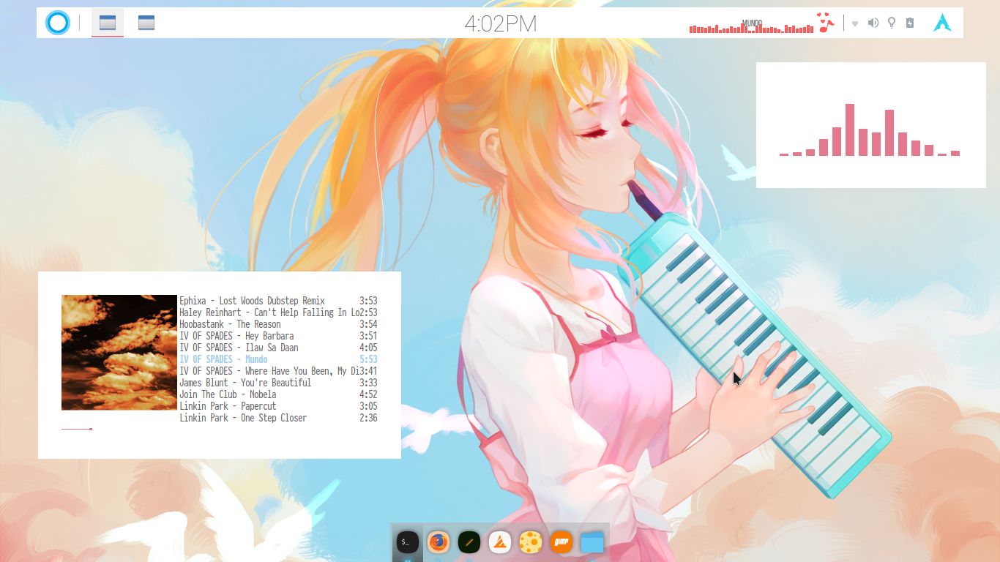

~~Personal/stolen dotfiles.~~
# Golden Age Dotfiles

## Golden Age Details
*This is my very first rice before the switch to Windows because I have to do my thesis.
I almost forgot about this bspwm setup. I feel nostalgic while typing this.*

+ **Distro**: GLORIOUS ARCH  
+ **WM**: BSPWM  
+ **COMPOSITOR**: compton with kawase  
+ **GTKTHEME**: Lumiere  
+ **ICONS**: Xenlism-wildfire  
+ **BAR**: tint2 + hiding polybars  
+ **DOCK**: plank  
+ **Launcher**: rofi and dmenu-extended  

| Clean | urxvt-patched | Pop-up music info** | Pop-up systemifo** |
| --- | --- | --- | --- |
|  |  |  |  |

| NCMPCPP + cava | filemanager and icons by munanazzal | rofi and dmenu-extended |
| --- | --- | --- | --- |
|  |  |  |  |

